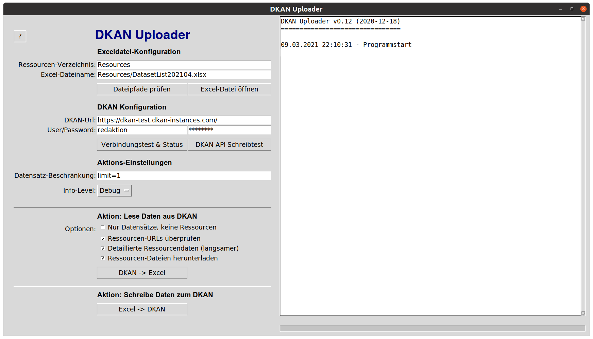

# Dokumentation der Software "DKAN-Uploader"


**Inhaltsverzeichnis**

- [Einleitung](#einleitung)
- [Bedienung der grafischen Benutzerobferfläche](#gui)
- [Aufbau der Excel-Datei](#excel)
- [Bedienung über die Kommandozeile](#kommandozeile)
- [Hilfe bei Problemen](#hilfe)

<a name="einleitung"></a>
## Einleitung

Mit *DKAN-Uploader* können Sie die Metadaten in einer Instanz der Open-Data-Portal-Software "DKAN" (https://getdkan.org/) verwalten.

Programmfunktionen:

* Alle Metadaten der Datensätze und Ressourcen aus den DKAN-Open-Data-Portal in eine Excel-Datei exportieren
* Die (externen) Links aller Ressourcen überprüfen
* Die Metadaten verschiedener Datensätze gleichzeitig bearbeiten indem Sie diese aus einer lokalen Excel-Datei überschreiben
* Neue Datensätze anlegen anhand der Informationen aus einer lokalen Excel-Datei

Es handelt sich um eine in der Programmiersprache Python entwickelte Anwendung. Diese kann über eine grafische Windows- oder Linux-Benutzeroberfläche bedient werden. Ebenso wird eine Ausführung über die Kommandozeile unterstützt.


# Programmstart der grafischen Benutzeroberfläche

**Unter Linux**

Führen Sie zum Starten der grafischen Bedienoberfläche folgende Befehle aus:

```
  git clone https://github.com/od-ms/dkan-dataset-uploader.git
  cd dkan-dataset-uploader
  pip3 install -r requirements.txt
  python3 -m dkan-uploader
```

<a name="gui"></a>
## Aufbau der grafischen Benutzeroberfläche


Die grafische Benutzeroberfläche ist folgendermaßen aufgebaut:

**Linke Seite: Aktionsflächen**<br />
Auf der linken Seite des Anwendungsfensters befinden sich Input-Felder für verschiedene Konfigurationseinstellungen, sowie Radioboxen und Buttons zum Ausführen der Programmfunktionen.

**Rechte Seite: Fenster für Logmeldungen**<br />
Auf der rechten Seite des Anwendungsfensters sehen sie ein großes Textfeld, in dem Logmeldungen angezeigt werden. Während der Bedienung der Anwendung erscheinen darin Informationen zu den letzten ausgeführten Aktionen und zu eventuell aufgetretenen Fehlern.

## Bedienung der Benutzeroberfläche

### Konfiguration

Beim ersten Start sollten Sie die Bereiche "Exceldatei-Konfiguration" und "DKAN Konfiguration" ausfüllen.
Die von Ihnen eingetragenen Werte werden beim Aufruf einer Aktion oder beim Beenden des Programms automatisch in der Datei *config.ini* im Anwendungsverzeichnis gespeichert und steht beim nächsten Start der Anwendung wieder zur Verfügung.

**Exceldatei-Konfiguration**<br />

 * *Ressourcen-Verzeichnis:* Hier müssen Sie angeben, in welchem Unterverzeichnis die Ressourcen-Dateien abgelegt werden. Dieses Verzeichnis wird sowohl beim Download von Ressourcen genutzt, als auch beim Upload von Ressourcen mit lokalen Dateien.
 * *Excel-Dateiname:* Die Datei mit diesem Namen wird zum Ein- und Auslesen von Datensätzen genutzt. Wenn die Datei noch nicht existiert, dann wird sie beim Aufruf des Buttons `DKAN -> Excel` (s.u.) automatisch angelegt.
 * Button `Dateipfade prüfen` prüft ob das angegebene Verzeichnis und die Datei existieren und gibt ggf. weitere Informationen dazu aus.
 * Button `Excel-Datei öffnen` öffnet die Excel-Datei mit der Standardanwendung, die in ihrem Betriebssystem hinterlegt ist (z.B. mit Libre- oder Microsoft-Office).

**DKAN Konfiguration**<br />

* Tragen Sie die URL des DKAN-Portals sowie Benutzernamen und Passwort in die entsprechenden Felder ein.
* Button `Verbindungstest & Status` prüft die angegebenen Verbindungsdaten und stellt eine Test-Verbindung zum DKAN-System her.
* Button `DKAN API Schreibtest` unterzieht die angegebene DKAN-Instanz einigen Schreib- und Lesetests um festzustellen, ob die erwarteten API-Antworten gegeben werden. Dies ist notwendig, um festzustellen, ob die DKAN-Instanz kompatibel ist.

**Aktions-Einstellungen**<br />

* *Datensatz-Beschränkung*: Wenn Sie nicht möchten, dass alle Datensätze des DKAN bearbeitet werden, sondern wenn Sie dies auf einzelne Datensätze einschränken möchten, dann nutzen Sie dafür das Feld "Datensatz-Beschränkung":
  * Beschränkung auf einzelnen Datensatz per ID: Sie können IDs der Datensätze eintragen, die gelesen oder geschrieben werden sollen. Bei mehreren Datensätzen trennen Sie diese per Komma. Steht im Feld z.B.: `aca473a1-f20c-467a-b1ab-021bd93c4962, 2ca04273-af8d-4f47-a7c8-c455a4979354`, dann wird beim betätigen des Button "Excel -> DKAN" nur die Zeilen aus der Excel-Datei bearbeitet, die die angegebenen IDs in der ID-Spalte enthalten. Wird keine der IDs gefunden, dann wird keine Aktion ausgeführt.
  * Beschränkung auf Anzahl Datensätze: Schreiben Sie in das Feld `limit=X`, wobei die X die Anzahl der zu lesenden oder schreibenden Datensätze ist. Wenn im Feld "Datensatz-Beschränkung" z.B. `limit=2` steht, dann werden nur 2 Datensätze aus dem DKAN oder aus ihrer Excel-Datei gelesen, und danach wird der Prozess beendet.
* *Info-Level*: Wenn Sie mehr Informationen über den Ablauf des Programms erhalten möchten, dann können das Info-Level auf "Debug" stellen. Im Fenster für Logmeldungen werden dann in hellgrauer Schrift zusätzliche Statusmeldungen ausgegeben. Dies kann Ihnen z.B. auch bei der Fehlersuche helfen, falls DKAN-Uploader nicht wie erwartet funktioniert.

### Export von Datensatz- und Ressourcen-Informationen aus dem DKAN in eine Excel-Datei

**Aktion: Lese Daten aus DKAN**<br />
Um Daten aus dem DKAN in eine Excel-Datei zu exportieren, klicken Sie auf den Button **"DKAN->Excel"**. Wenn Sie bei "Aktions-Einstellungen" eine Datensatz-Beschränkung eingegeben haben, werden nur diese Einschränkungen berücksichtigt. Ansonsten werden *alle* Datensätze aus dem DKAN in die Excel-Datei geschrieben. Die Daten werden aus der DKAN-Instanz dabei nur gelesen und nicht verändert.

Außerdem können Sie folgende Optionen einstellen:

 * Checkbox `Nur Datensätze, keine Ressourcen`: Wenn diese Checkbox ausgewählt ist, werden nur die Metainformationen der Datensätze, nicht aber die Informationen zu den zugehörigen Ressourcen ausgelesen. Die Excel-Datei hat dann weniger Spalten und das Auslesen der Daten geht schneller.
 * Checkbox `Ressourcen beim Download überprüfen`: Wenn dies angehakt ist, werden alle externen Ressourcen-Urls ihres Open-Data-Portals geprüft, und das Ergebnis wird in der Excel-Datei vermerkt. Somit können Sie sehen, ob die Links auf externe Ressourcen-Dateien noch funktionieren. Ihr Computer wird dann versuchen, jede Ressourcen-URL per HTTP-HEAD-Request abzurufen, um festzustellen, ob der Link noch funktioniert. Der Abruf der Daten dauert dadurch deutlich länger. Die Ressourcen werden dabei nicht heruntergeladen, sondern nur geprüft.
 * Checkbox `Detaillierte Ressourcendaten (langsamer)`: Aufgrund der DKAN-Schnittstelle kann die Information, ob es sich bei einer Ressource um "Remote File" oder "API Link" handelt, nur mit beim anhaken dieser Checkbox gelesen werden. Das verlangsamt das Auslesen der Daten aus dem DKAN enorm. Wenn Sie diese Information nicht benötigen, dann sollten Sie diese Checkbox nicht verwenden.
 * Checkbox `Ressourcen-Dateien herunterladen`: Nutzen Sie dies, um alle Ressourcen herunterzuladen (falls möglich) und im konfigurierten Verzeichnis (s.o. "Ressourcen-Verzeichnis") abzulegen.

### Schreiben von Daten in die DKAN-Instanz

**Aktion: Schreibe Daten zum DKAN**<br />
💣`Achtung! Mit dieser Funktion werden Daten in der DKAN-Instanz überschrieben. Sie können alle Metadaten in Ihrem Open-Data-Portal verändern und bei falscher Bedienung alle Datensätze überschreiben.`💣

Klicken Sie dazu auf den Button **"Excel->DKAN"**.

Dann werden alle Einträge aus der Excel-Datei Zeile für Zeile abgearbeitet und in das DKAN-Portal übertragen.

Dabei gelten folgende Regeln:

* Jede Zeile der Excel-Datei erzeugt im DKAN-Portal einen Datensatz oder eine Ressource.
* Eine Zeile mit einer Datensatz-ID in der ersten Spalte überschreibt den entsprechenden Datensatz im DKAN-Portal. Wird kein Datensatz mit der ID gefunden, wird eine Warnung ausgegeben und mit der nächsten Zeile wird fortgefahren.

Zu Beginn wird die Excel-Datei einer Plasibilitätsprüfung unterzogen: Es werden die Spaltennamen mit den von der DKAN-Instanz benötigten Spalten abgeglichen. Sollten Spalten fehlen wird eine entsprechende Fehlermeldung ausgegeben und die Aktion wird sofort abgebrochen.

Sie sollten während der Ausführung auf das Fenster mit den Logmeldungen achten. Wenn Probleme festgestellt werden, z.B. beim Anlegen von Datensätzen oder Ressourcen, dann werden entsprechende Informationen im Fenster mit Logmeldungen ausgegben.

<a name="excel"></a>
# Aufbau der Excel-Datei

Die erzeugte Excel-Datei hat den folgenden Aufbau:

 * Jede Spalte entspricht einem Datenfeld aus dem DKAN. Z.B. gibt es Spalten für "Datensatz-Titel", "Autor", "Kategorie", etc.
 * Die Spalten-Titel geben an, um welches Datenfeld es sich handelt. Unbekannte Spalten-Titel werden vom
 * DKAN-Uploader ignoriert.
 * Die ersten Spalten enthalten Informationen zu den Datensätzen. Das sind ungefähr die Spalten A-AF (abhängig davon, wie viele individuelle "Extra"-Felder sie im DKAN angelegt haben)
 * In den hinteren Spalten ab der Spalte "Resource-ID" stehen die Datenfelder von Ressourcen. Ressourcen sind die zu Datensätzen hinterlegten Dateien oder Links. Ein Datensatz kann immer mehrere Ressourcen haben, und Ressourcen müssen immer zu genau einem Datensatz gehören.
 * Jede Zeile, in der die ersten Spalten ausgefüllt sind, entspricht einem Datensatz
 * Jede Zeile, in denen die hinteren Spalten ab "Resource-ID" ausgefüllt sind, entsprechen einer Ressource.
 * In einer Zeile kann auch beides enthalten sein, das ist meist in der ersten Zeile eines Datensatzes der Fall.
 * Es werden in der Excel-Datei automatisch Spalten-"Gruppen" erzeugt, so dass man unbenötigte Spalten ausblenden kann und die Übersichtlichkeit gewahrt bleibt. Um Spalten ein- und auszuklappen klicken Sie in Ihrem Office-Programm (z.B. Excel oder LibreOffice) auf das entsprechende Plus- bzw. Minus-Zeichen über der ersten Zeile. Beim schreiben aus einer Excel-Datei in ein DKAN-Portal werden immer alle Spalten geschrieben, egal ob sie im Excel eingeklappt sind oder nicht.


<a name="kommandozeile"></a>
# Bedienung der Software über die Kommandozeile

Mit folgendem Befehl können Sie die Software im Kommandozeilen-Modus starten:

```
python3 -m dkan-uploader -h
```

Die Bedienungsanleitung für den Kommandozeilenmodus und die unterschiedlichen verfügbaren Kommandozeilenparameter werden dann über die Kommandozeile ausgegeben.

<a name="hilfe"></a>
# Hilfe bei Problemen

Sollte etwas nicht funktionieren, prüfen Sie bitte die Meldungen im Log-Fenster (Rechte Hälfte des Andwenungsfensters, bzw. bei Kommandozeilenbetrieb erscheinen die Meldungen auf der Kommandozeile).
Außerdem wird bei jedem Programmstart im Unterverzeichnis `logs/` (unterhalb des Anwendungsverzeichnisses) eine Logdatei angelegt mit dem Dateinamen `Datum-Uhrzeit.log`. Dort werden mit "Debug"-Level alle Aktionen protokolliert. Falls etwas nicht klappt, können Sie dort evtl. genauere Fehlermeldungen nachschauen.

Die folgende Liste kann Ihnen helfen, die Fehlermeldungen des Programms zu interpretieren:

## Liste der Fehlermeldungen

* ```Fehler 5001```: *Die DKAN-API hat nicht im JSON-Format geantwortet.*<br />
  Häufig hat das einen der folgenden Gründe:

    * Ein Eingabeparameter für die DKAN-API hat nicht das erwartete Format. <br />
    *Lösung:* Wenn dies beim Upload auftritt, sind eventuell in der Excel-Datei nicht alle benötigten Spalten korrekt ausgefüllt. Füllen Sie alle Spalten aus.

    * Das API-Format hat sich geändert. Tritt z.B. auf, wenn Sie eine zu dieser Software inkompatible DKAN-Version nutzen. <br />
    *Lösung:* Prüfen Sie die Versionsnummer der von Ihnen verwendete DKAN-Instanz und gleichen Sie diese mit der vom Programm unterstützten Version ab. Wenn die Versionen inkompatibel sind, lassen Sie diese Software auf die neuere DKAN-Version anpassen, oder passen Sie selbst den Programmcode an, der die API anspricht.

* ```Fehler 5002```: *Die DKAN-API-Antwort hat ein unerwartetes JSON-Format.* <br />
  Im DKAN-Updater-Quellcode sind JSON-Schemas hinterlegt, die die erwartete Antwort-Struktur der DKAN-API enthalten. Weicht die DKAN-API-Antwort davon ab, dann liegt das vermutlich daran, dass die von Ihnen verwendete DKAN-Version nicht kompatibel ist zu dieser Version des DKAN-Updater.

* ```Fehler 5003```: *Die DKAN Instanz ist nicht kompatibel zu DKAN-Uploader* <br />
  Bei der Überprüfung der DKAN-API-Datenformate wurde festgestellt, dass die von Ihnen genutzte DKAN-Instanz nicht kompatibel ist. *Lösung:* Kontaktieren Sie eine Person Ihres Vertrauens mit Python-Softwareentwicklungsexpertise, und bitten Sie diese Person, den Open-Source-Quellcode dieser Anwendung anzupassen.

* ```Fehler 5005```: *Datensatz konnte nicht 1:1 angelegt werden* <br />
  Dieser Fehler kann auftreten beim Anlegen eines Test-Datensatzes im DKAN. Dabei wurde dann festgestellt, dass beim Auslesen des gerade erst angelegten Test-Datensatzes einige Feldwerte nicht mit den geschriebenen Werten übereinstimmen. Das muss nicht unbedingt ein Problem sein. Wenn Sie diese Fehlermeldung erhalten, dann sollte im selben Fenster für die Logmeldungen oberhalb der Fehlermeldung eine Zusammenfassung angezeigt werden, welche Felder nicht exakt übereinstimmen. Sie können anhand dieser Logmeldungen übereprüfen, ob der Fehler als problematisch zu bewerten ist. Das passiert z.B. wenn die DKAN Konfiguration geändert wurde, und die Lizenz-Namen nicht mehr übereinstimmen.

* ```Fehler 6000```: In der Excel-Datei wurde eine Spalte nicht gefunden. Das kann z.B. passieren, wenn eine von DKAN benötigte Spalte fehlt, oder einen falschen Titel in der ersten Zeile hat. Prüfen Sie die Titelzeilen der Spalten, möglicherweise ist dort ein Tippfehler. Oder die wichtige Spalte fehlt. Falls Sie das Problem nicht in ihrer Excel-Datei finden, können Sie am besten den DKAN Inhalt in eine andere Excel-Datei downloaden, indem Sie im Feld "Excel-Dateiname" einen neuen, noch nicht verwendeten Dateinamen eingeben und indem Sie dann den Button "DKAN->Excel" anklicken. Es wird eine neue Excel-Datei erstellt, und in dieser Datei können Sie dann in der ersten Zeile sehen, welche Spalten benötigt werden. Vergleichen Sie das mit der Datei die Sie versuchen einzulesen und passen Sie in ihrer Datei die erste Zeile entsprechend an.

## Nicht unterstützte Datenfelder

 Folgende Felder von DKAN-Datensätzen werden nicht vom DKAN-Uploader unterstützt, d.h. sie können nicht ausgelesen oder geschrieben werden:

 * `Lizenz` => Es werden seit neustem leider nur die Lizen-Kürzel übernommen
 * Alle `Playground`-Felder => Besonderheit weniger DKAN-Instanzen
 * `Harvest Source` => Kann nicht geschrieben werden

## Bekannte Probleme

* **Unveröffentlichte Datensätze**: Der Daten-Download des DKAN-Uploader funktioniert nur mit **veröffentlichten** Datensätzen, da nur solche Datensätze über die CKAN API abgerufen werden können.

* **Fehlende API Endpunkte im DKAN**: Die DKAN-API bietet keine Endpunkte zum Abruf der "Stichworte" ("dataset_tags") oder "Dateitypen". Da zu diesen allerdings die IDs benötigt werden, werden sie über das HTML-Administrations-Interface von DKAN abgerufen und "gescraped". Dabei handelt es sich um die Urls `/admin/structure/taxonomy/dataset_tags` und `/admin/structure/taxonomy/format`. Solle es damit zu Problemen kommen, prüfen Sie bitte, ob Sie sich nach einloggen die o.g. Urls abrufen können.

