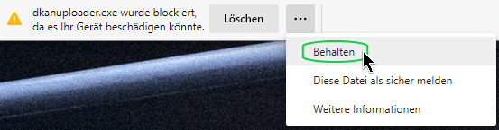
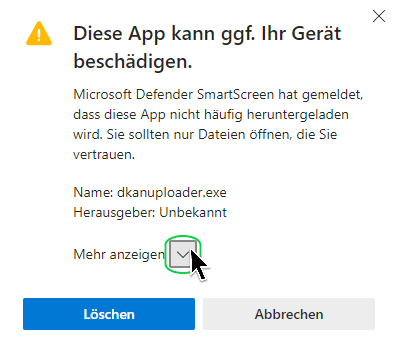
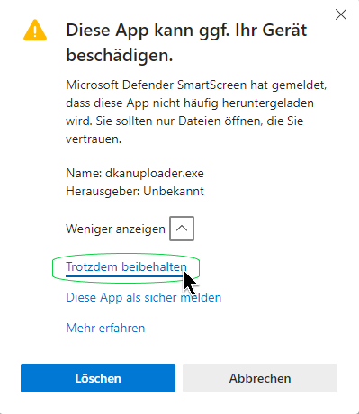
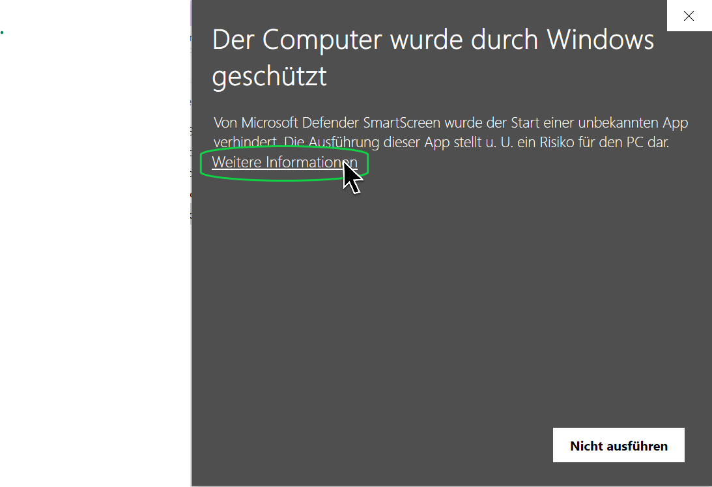
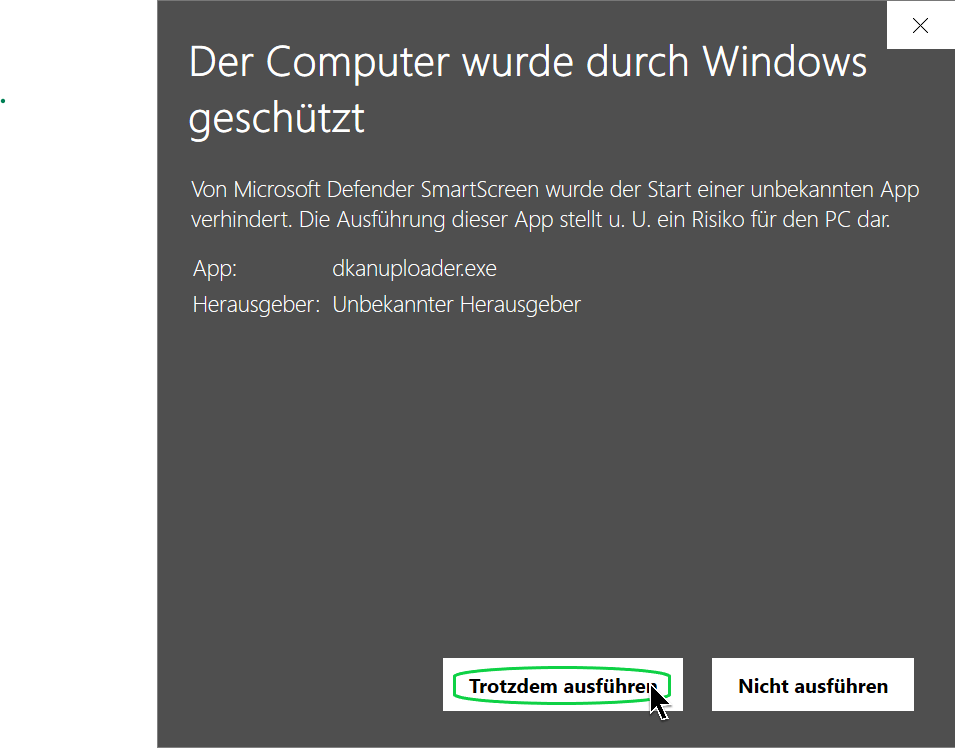

# DKAN Dataset Uploader unter Windows starten

## Warnung im Edge Browser
Nach dem Download mit Microsoft Edge erhalten Sie folgende Warnung:

Klicken Sie nach dem Download die drei Punkte "..." und wählen Sie "Behalten".

## Hinweisfenster nach dem Download

Falls nach dem Download ein Hinweisfenster erscheint, dass die App Ihr Gerät beschädigen kann, dann bestätigen Sie dieses Fenster wie in den folgenden beiden Screenshots gezeigt:

||
-

||
-

## Warnung vor dem Starten

Wenn Sie die dkanuploader.exe-Datei zum Starten anklicken möchten, erscheint folgendes Fenster. Das sollten Sie dann schließen wie unten gezeigt durch einen Klick auf "Weitere Informationen" und dann auf "Trotzdem ausführen":

